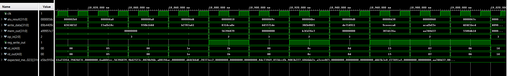

# MEM_STAGE
## Overview
This project implements the **Memory (MEM) Stage** of a 5-stage pipelined RISC-V processor using VHDL. It handles load (`lw`) and store (`sw`) instructions, performing word-aligned memory accesses via an external `DATA_MEM` module. The MEM stage also passes control signals (`rd`, `reg_write`) to the WB stage.
*This project was designed, written, and tested by me as part of my exploration into pipelined CPU architecture.*

## Features
- Interfaces with a 32-bit word-addressable memory (`DATA_MEM`)
- Word-aligned address generation from `alu_result(11 downto 2)`
- Memory read (`mem_read_in`) and write (`mem_write_in`) logic
- Pass-through of control signals: `reg_write_in`, `rd_in`
- Fully randomized testbench with 5000 cases
- Visual waveform inspection with injected errors for debugging

## Project Structure
**MEM_STAGE**/
- images/
    - tcl.png, wave_no_bug.png, wave_with_bug.png
- src/
    - MEM_STAGE.vhd, DATA_MEM.vhd, reusable_function.vhd, function_definition.vhd
- test_benches/
    - tb_MEM_STAGE.vhd
- .gitignore
- README.md

## 🔌 Interface

### Entity: `MEM_STAGE`

| Port            | Dir  | Width | Description                            |
|-----------------|------|--------|---------------------------------------|
| `clk`           | in   | 1      | Clock signal                          |
| `alu_result`    | in   | 32     | Byte address from EX stage            |
| `write_data`    | in   | 32     | Data to store into memory             |
| `mem_out`       | out  | 32     | Data read from memory                 |
| `op_in`         | in   | 3      | Control signal for load or store      |
| `rd_in`         | in   | 5      | Destination register address (input)  |
| `reg_write_out` | out  | 1      | Passed to WB stage                    |
| `rd_out`        | out  | 5      | Passed to WB stage                    |

## 🧪 Testbench Strategy
- Uses `uniform()` from `math_real` to randomize:
  - Memory addresses (0–1023)
  - 32-bit `write_data`
  - `rd` register (0–31)
  - `reg_write_in` values
- Separates memory **write** and **read** phases to prevent overlap
- Tracks `expected_memory` array to verify `mem_out` on each read
- Simulates signal glitch injection using `'X'` and `'Z'` patterns

## 📊 Simulation Results

### Tcl Console Output
  
*All 5000 randomized memory operations passed.*

### Waveform: Memory Read and Memory Write
  
***Observation***
- rd_in = rd_out
- When op_in is 2 (load), it will send data from the memory which mean reg_write_out is 1. So data need to be written back in rd.
- When op_in is 3 (store), it wrote something in the memory which mean reg_write_out is 0. So there's no data need to be written back in rd.

  
*This waveform shows behavior when an intentional conflict or signal glitch is injected. For debugging purposes, mem_read_in and mem_write_in were briefly allowed to overlap or garbage values ('X', 'Z') were forced into the design to observe how the system responds to invalid states.*

## 💡 Key Learnings
- I used the waveform viewer in Vivado to check signal values and detect problems like X (unknown) and Z (high-impedance).
- I confirmed that memory only performs reads when op = '2' and writes when mem_write_in = '3', with no conflicts between them.
- I intentionally added bugs (like reading and writing at the same time) to see how errors show up in the waveform.

## ▶️ How to Run

1. Launch **Vivado 2019.2** or later
2. Create or open a project and add:
    - `src/*.vhd` (design files)
    - `test_benches/tb_MEM_STAGE.vhd`
3. Set `tb_MEM_STAGE.vhd` as the simulation top module
4. Run Behavioral Simulation:
    - *Flow > Run Simulation > Run Behavioral Simulation*
5. Increase simulation time if needed
6. Observe:
    - Console output (for pass/fail)
    - Waveform viewer (for data, control, and glitch inspection)

## 👤 Author
**Noridel Herron**  
Senior in Computer Engineering – University of Missouri  
✉️ noridel.herron@gmail.com  
GitHub: [@NoridelHerron](https://github.com/NoridelHerron)

---

## 🤝 Contributing
This is a personal academic project. Feedback and suggestions are welcome via GitHub issues or pull requests.

---

## 📜 License
MIT License

---

## ⚠️ Disclaimer
This project is for **educational use only**. Some components may be experimental and are not intended for production use.
